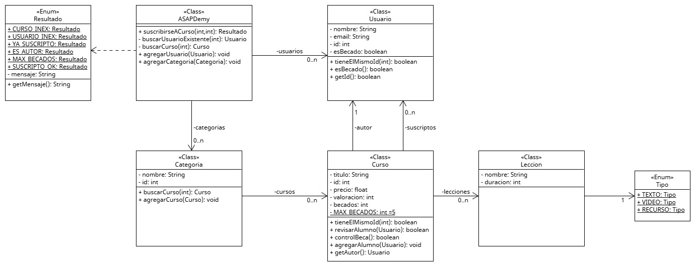

# Clase 5 – Ejercicio: Ejercicio ASAPDemy

## Consigna

El sitio de cursos online “ASAPDemy” nos encomienda un sistema para manejar su plataforma, lacual, en primer lugar, consta de usuarios con ID, nombre, mail y si es o no becado. A su vez, en el sitio podemos encontrar categorías, de las cuales interesa conocer su ID y su nombre. Cada categoría cuenta con diferentes cursos, de los cuales se conoce su ID, su título, su precio y su valoración en estrellas. Además, se sabe quién es el autor de dicho curso, el cual debe ser un usuario del sitio.

Dentro del curso se encuentran las diferentes lecciones, de las cuales interesa saber su nombre, su duración en minutos y su tipo (texto, video o recurso). Por último, cada curso consta de una lista de usuarios suscriptos al mismo con la limitación de que no puede haber más de 5 alumnos con condición de becados en el mismo.

Basado en el enunciado, realizar:
El método suscribirseACurso el cual recibe un ID de usuario y un ID de curso y debe retornar alguno de los siguientes resultados:
CURSO_INEX: El curso no existe.
USUARIO_INEX: El usuario no existe.
YA_SUSCRIPTO: El usuario ya estaba suscripto en el curso.
ES_AUTOR: El usuario que intenta suscribirse es el autor del curso.
MAX_BECADOS: El usuario es becado y el curso ya cuenta con el máximo de becados posible.
SUSCRIPTO_OK: El usuario se suscribió exitosamente al curso. Debe guardarse en la lista de suscriptos.

---

## UML

