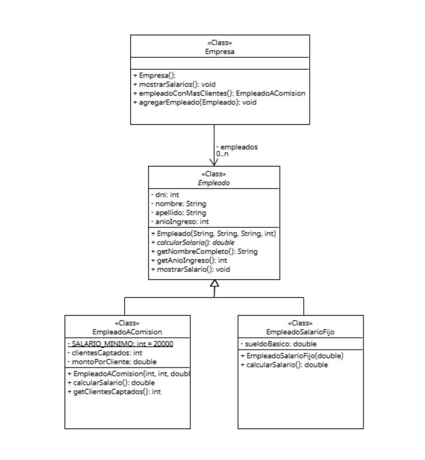

# Clase 6 – Ejercicio: Administrador de Personal

## Consigna

Cierta empresa requiere una aplicación informática para administrar los datos de su personal, del cual se conoce: número de DNI, nombre, apellido y año de ingreso. Existen dos categorías de personal: el personal con salario fijo y el personal a comisión.

Los empleados a comisión tienen un salario mínimo de $20.000 (para todos igual), un número de clientes captados y un monto a cobrar por cada cliente captado. El salario se obtiene multiplicando los clientes captados por el monto por cliente. Si el salario obtenido por los clientes captados no llega a cubrir el salario mínimo, cobrará el salario mínimo.

Los empleados con salario fijo tienen un sueldo básico y un porcentaje adicional en función del número de años que llevan la empresa:
- Menos de 2 años: sueldo básico.  
- De 2 a 5 años: 5% más.  
- De 6 a 10 años: 10% más.  
- Más de 10 años: 15% más.

**Basado en el enunciado, realizar:**
1. La explotación del método `mostrarSalarios` que imprima por consola el nombre completo de cada empleado junto a su salario.
2. La explotación del método `empleadoConMasClientes` que devuelva al empleado con mayor cantidad de clientes captados (se supone único).

---

## UML

