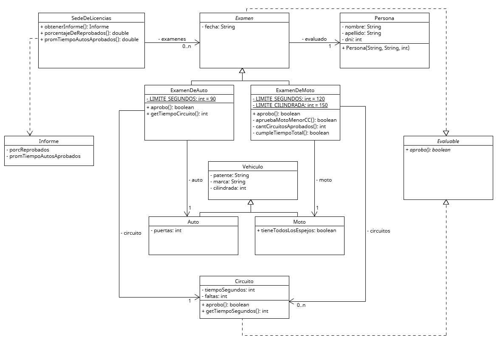

# Clase 7 – Ejercicio: Estadisticas de examenes de conducir

## Consigna

La sede de licencias de conducir de una jurisdiccion nos pide un prototipo para generar algunas estadisticas de los examenes tomados.
Todo examen consta de una fecha (String) y la persona que lo hizo (DNI, nombre y apellido). Como parte del examen, se debe realizar un circuito en caso de concursar para licencia de auto y varios circuitos en caso de concursar para licencia de moto.

Los examenes de moto guardan, ademas de los circuitos hechos, informacion sobre la moto con la que se hicieron las pruebas (patente, marca, cilindrada y si llevaba todos los espejos).

Los examenes de auto guardan, ademas del unico circuito realizado, informacion del auto con el que se hizo (patente, marca, cilindrada y cantidad de puertas).

De los circuitos (para cualquier tipo de examen) se sabe el tiempo en segundos que tomo y el numero de faltas
cometidas. Los circuitos y los examenes son evaluables, ya que deben dar un resultado: aprobo o no.

Condiciones para aprobar:
Circuitos:
Tener 2 faltas o menos.
Examenes de auto:
Que su circuito se haya aprobado en un minuto y medio o menos.
Examenes de moto:
Si la cilindrada de la moto es superior a 150cc, todos los circuitos deben haber sido aprobados (sin importar el tiempo).
Si la cilindrada de la moto es igual o inferior a 150cc, se puede tener hasta un solo circuito desaprobado y el tiempo total entre todos no debe superar los 2 minutos.

Basado en el enunciado, realizar:
El metodo obtenerInforme que debe devolver (no mostrar por consola) los siguientes datos:
Porcentaje de examenes reprobados.
Promedio de tiempo de los examenes de auto aprobados.

Test
Utilizar la siguiente clase Main para testear el ejercicio:

public class Main {
	public static void main(String[] args) {
		SedeDeLicencias sede = new SedeDeLicencias();
		ExamenDeAuto examenAuto01 = new ExamenDeAuto( //
				"2022-04-10", //
				new Persona("11111111", "Laura", "laura@mail.com"), //
				new Circuito(10, 2), //
				new Auto("IHW900", "Fiat", 1400, 5) //
		);
		/*------------------------------------*/
		ExamenDeAuto examenAuto02 = new ExamenDeAuto( //
				"2022-04-10", //
				new Persona("22222222", "Marcelo", "marcelo@mail.com"), //
				new Circuito(5, 2), //
				new Auto("LFP182", "Renault", 1400, 5) //
		);
		/*------------------------------------*/
		ExamenDeAuto examenAuto03 = new ExamenDeAuto( //
				"2022-04-10", //
				new Persona("33333333", "Victoria", "victoria@mail.com"), //
				new Circuito(100, 1), //
				new Auto("CHC078", "Renault", 1400, 5) //
		);
		/*------------------------------------*/
		ExamenDeMoto examenMoto01 = new ExamenDeMoto( //
				"2022-04-10", //
				new Persona("44444444", "Damian", "damian@mail.com"), //
				new Moto("PAS911", "Kawasaki", 250, true) //
		);
		examenMoto01.agregarCircuito(new Circuito(120, 1));
		examenMoto01.agregarCircuito(new Circuito(110, 0));
		/*------------------------------------*/
		sede.agregarExamen(examenAuto01);
		sede.agregarExamen(examenAuto02);
		sede.agregarExamen(examenAuto03);
		sede.agregarExamen(examenMoto01);
		/*---------------------------------------------------------------------*/
		// Test obtenerInforme
		System.out.println(sede.obtenerInforme());
	}
}

Resultado esperado:

{"porcReprobados":25.0,"promTiempoAutosAprobados":7.5}

Nota: Se sugiere utilizar la siguiente dependencia, que permite la serialización y deserialización entre objetos Java y su representación en notación JSON.

<dependency>
<groupId>com.google.code.gson</groupId>
<artifactId>gson</artifactId>
<version>2.8.9</version>
</dependency>

---

## UML

