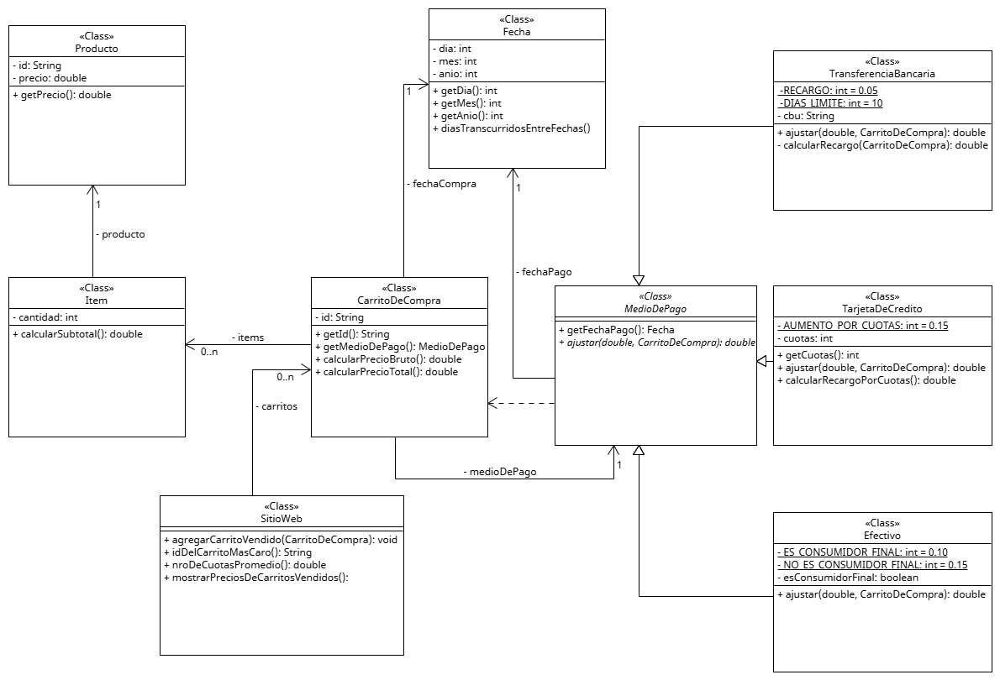

# Clase 7 – Ejercicio integrador

## Consigna

El responsable de un sitio web de compras online nos pide un prototipo para obtener algunas estadisticas de los carritos de compra que el sitio posee vendidos hasta el momento.

De cada carrito de compras vendido se sabe su ID (String), su fecha de compra (dia, mes y anio) los productos del carrito junto a la cantidad de cada uno (de cada producto se sabe su ID y su precio) y, por ultimo, el metodo de pago con el que se efectuo la compra del carrito.

De todos los medios de pago se sabe su fecha de pago (dia, mes y anio) y existen los siguientes:
En efectivo: Se guarda si se trato de un consumidor final o no. Se obtiene un 10% de descuento. 15% para los consumidores finales.
Por transferencia bancaria: donde se guarda el CBU (String) y el precio del carrito sera un 5% mas caro. Si pasaron mas de 10 dias desde la compra hasta la fecha de pago, sera otro 5% adicional (10% en total).
Con tarjeta de credito: donde se guarda con cuantas cuotas se abono y, entonces, el precio del carrito aumenta un 15% por cada cuota.

* diasTranscurridosEntreFechas es un metodo estatico de la clase Fecha de la libreria ihs-java-util (https://github.com/sanchezih/ihs-java-util/blob/main/src/main/java/com/github/sanchezih/util/Fecha.java)

Basado en el enunciado, realizar:
El metodo idDelCarritoMasCaro(), que retorne (no muestre por consola) el ID del carrito de compra de mayor precio.
El metodo nroDeCuotasPromedio(), que retorne (no muestre por consola) la cantidad de cuotas promedio con las que se abonaron los carritos de compra con tarjeta de credito.

Test
Utilizar la siguiente clase Main para testear el ejercicio:

public class Main {

	public static void main(String[] args) {

		// Creo los productos
		Producto shampoo = new Producto("1432", 100.0);
		Producto desodorante = new Producto("8246", 90.0);
		Producto lavandina = new Producto("8265", 80.0);
		Producto perfume = new Producto("2462", 70.0);
		Producto jabon = new Producto("1176", 30.0);
		Producto dentifrico = new Producto("3484", 50.0);
		/*---------------------------------------------------------------------*/

		// Precio bruto = 200, como NO es consumidor final = 180
		List<Item> itemsCarrito01 = new ArrayList<Item>();
		itemsCarrito01.add(new Item(2, shampoo));
		CarritoDeCompra carrito01 = new CarritoDeCompra( //
				"001", //
				itemsCarrito01, //
				new Efectivo(new Fecha(10, 11, 2022), false), //
				new Fecha(10, 11, 2022));
		/*--------*/

		// Precio bruto = 270, como es consumidor final = 229.5
		List<Item> itemsCarrito02 = new ArrayList<Item>();
		itemsCarrito02.add(new Item(3, desodorante));
		CarritoDeCompra carrito02 = new CarritoDeCompra( //
				"002", //
				itemsCarrito02, //
				new Efectivo(new Fecha(10, 11, 2022), true), //
				new Fecha(10, 11, 2022));
		/*--------*/

		// Precio bruto = 170, como es pago por tx < 10 dias = 178.5
		List<Item> itemsCarrito03 = new ArrayList<Item>();
		itemsCarrito03.add(new Item(4, jabon));
		itemsCarrito03.add(new Item(1, dentifrico));
		CarritoDeCompra carrito03 = new CarritoDeCompra( //
				"003", //
				itemsCarrito03, //
				new TransferenciaBancaria(new Fecha(28, 03, 2023), "8102876342910973276541"), //
				new Fecha(25, 03, 2023));
		/*--------*/

		// Precio bruto = 170, como es pago por tx > 10 dias = 187
		List<Item> itemsCarrito04 = new ArrayList<Item>();
		itemsCarrito04.add(new Item(4, jabon));
		itemsCarrito04.add(new Item(1, dentifrico));
		CarritoDeCompra carrito04 = new CarritoDeCompra( //
				"004", //
				itemsCarrito04, //
				new TransferenciaBancaria(new Fecha(25, 04, 2023), "8102876342910973275555"), //
				new Fecha(25, 03, 2023));
		/*--------*/

		// Precio bruto = 320, como paga con tc en 6 ctas = 608
		List<Item> itemsCarrito05 = new ArrayList<Item>();
		itemsCarrito05.add(new Item(4, lavandina));
		CarritoDeCompra carrito05 = new CarritoDeCompra( //
				"005", //
				itemsCarrito05, //
				new TarjetaDeCredito(new Fecha(25, 04, 2023), 6), //
				new Fecha(10, 11, 2022));
		/*--------*/

		// Precio bruto = 140, como paga con tc en 12 ctas = 392
		List<Item> itemsCarrito06 = new ArrayList<Item>();
		itemsCarrito06.add(new Item(2, perfume));
		CarritoDeCompra carrito06 = new CarritoDeCompra( //
				"006", //
				itemsCarrito06, //
				new TarjetaDeCredito(new Fecha(25, 04, 2023), 12), //
				new Fecha(10, 11, 2022));
		/*---------------------------------------------------------------------*/
		SitioWeb sitioWeb = new SitioWeb();
		sitioWeb.agregarCarritoVendido(carrito01);
		sitioWeb.agregarCarritoVendido(carrito02);
		sitioWeb.agregarCarritoVendido(carrito03);
		sitioWeb.agregarCarritoVendido(carrito04);
		sitioWeb.agregarCarritoVendido(carrito05);
		sitioWeb.agregarCarritoVendido(carrito06);
		System.out.println("PRECIOS DE LOS CARRITOS VENDIDOS");
		sitioWeb.mostrarPreciosDeCarritosVendidos();
		System.out.println();
		System.out.println("El id del carrito mas caro es: " + sitioWeb.idDelCarritoMasCaro());
		System.out.println();
		System.out.println("El numero de cuotas promedio es: " + sitioWeb.nroCuotasPromedio());
	}
}

Resultado esperado:

PRECIOS DE LOS CARRITOS VENDIDOS
	Carrito 001: $180.0
	Carrito 002: $229.5
	Carrito 003: $178.5
	Carrito 004: $187.0
	Carrito 005: $608.0
	Carrito 006: $392.0
El id del carrito mas caro es: 005
El numero de cuotas promedio es: 9.0

---

## UML

